# harnesside

A local coding agent: a daemon that drives a llama.cpp server on your own machine
and serves a web IDE into a dedicated Chrome window. OpenAI Chat Completions
compatible. Installed from one portable zip per platform.

> 내 PC 의 llama.cpp 서버로 도는 로컬 코딩 에이전트입니다. 데몬이 모델 서버를 관리하고,
> 전용 Chrome 창에 웹 IDE 를 띄웁니다. OpenAI Chat Completions 와 호환됩니다.
> 플랫폼마다 포터블 zip 하나로 설치합니다. 설계 배경과 전체 요구사항은 [`PROMPT.md`](./PROMPT.md).

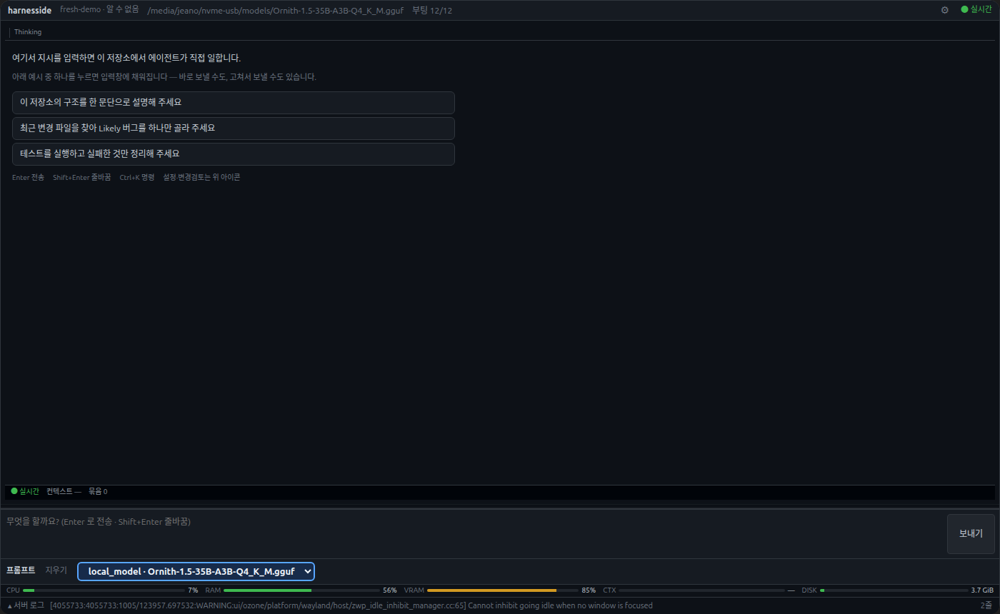

- 위쪽 헤더 — 프로젝트 · **사용 중인 모델 경로** · `부팅 12/12` · `실시간`
- 누를 수 있는 예시 프롬프트 3개, 그 아래 단축키 안내
- 맨 아래 계측바 `CPU · RAM · VRAM · CTX · DISK` — 숫자가 아니라 막대

이 README 의 그림은 전부 실제로 뜬 창을 CDP(`Page.captureScreenshot`)로 찍은 것이다.
창 내용은 `node scripts/verify-window.mjs` 로 그림 없이도 검증된다 (22/22).

## 설치

**설치 경로는 자기 플랫폼의 포터블 zip 하나뿐이다.** npm 패키지도, 체크아웃 빌드 설치도 없다.
설치와 셀프업데이트가 같은 zip 을 쓴다.

1. [Releases](https://github.com/jeano76/harnesside/releases/latest) 에서
   `harnesside-portable-<platform>-<arch>.zip` 을 받는다.

   | 플랫폼 | 파일 |
   |---|---|
   | Linux x64 · arm64 | `harnesside-portable-linux-x64.zip` · `…-linux-arm64.zip` |
   | Windows x64 · arm64 | `harnesside-portable-win32-x64.zip` · `…-win32-arm64.zip` |
   | macOS Apple Silicon · Intel | `harnesside-portable-darwin-arm64.zip` · `…-darwin-x64.zip` |

   다른 플랫폼 zip 은 네이티브 모듈(`node-pty`)이 맞지 않아 돌지 않는다.
2. 아무 곳에나 압축을 푼다. **Node 22 이상**만 있으면 된다 (npm 불필요).
3. 푼 폴더에서 설치 스크립트를 실행한다.
   - Windows: `Install-Portable.ps1` 우클릭 → "PowerShell에서 실행"
   - Linux · macOS: `sh install.sh` (bash · zsh · dash · fish 어디서든)
4. 실행: `./harnesside.sh` · `harnesside.cmd` · 바탕화면 바로가기.

설치 스크립트가 하는 일 — 순서대로, 가정하지 않고 **실행해서** 확인한다.

| 단계 | 내용 |
|---|---|
| 점검 | Node ≥ 22 · zip 이 **이 머신** 플랫폼용인가 · `portable-manifest.json` 으로 전 파일 해시 대조 |
| `setup` | 하드웨어 감지 → 이 머신에서 **실제로 뜨는** llama-server 확보 (CUDA → ROCm → Vulkan → CPU, macOS 는 Metal) → 모델 선택·다운로드 → 예측 튜닝 |
| `measure` | **이 머신에서 실측** — 엔진을 띄워 고정 프롬프트로 프리필·생성 tok/s 와 남은 메모리를 몇 가지 설정에서 재고, 가장 빠른 설정을 채택 |
| 바로가기 | 바탕화면 바로가기 |

`measure` 결과는 `.harnesside/state/measurements.json` 과 `~/.harnesside/machine-profile.json` 에
남고, 이후 기동은 엔진·모델·컨텍스트·오프로드가 같을 때 그 실측값을 쓴다.
설치 옵션: `--measure=full`(후보 더 많이) · `--no-measure` · `--models-dir=DIR` · `--no-shortcut`.
언제든 `harnesside measure` 로 다시 잴 수 있다.

### 요구 환경

| | 요구 | 확인 |
|---|---|---|
| Node | **22 이상** | `node -v` |
| 브라우저 | Chrome 또는 Chromium | `harnesside doctor` |
| GPU | 선택 — 없으면 CPU 로 돈다 | `harnesside doctor` |
| llama.cpp · 모델 | **설치 스크립트가 준비** | `harnesside doctor` |

- Node 20 은 측정했고 동작하지 않는다 — `node-pty` 가 종료 시 SIGSEGV 로 죽고, 전역 `WebSocket` 이 없다.
- `harnesside doctor` 는 같은 판정을 **아무것도 바꾸지 않고** 보여준다. 못 잰 것은 0 이나 false 가 아니라 **미확인**으로 적는다.
- 프로젝트별 상태는 **작업 디렉터리**를 따라간다 — 프로젝트마다 `.harnesside/config.yaml` · `rules/` · `skills/` 를 갖는다.
- 제거: 폴더를 지운다. 모델·엔진·머신 프로필까지 지우려면 `~/.harnesside` 도.

### 명령

| 명령 | 하는 일 |
|---|---|
| `harnesside` | 서버 + 창 기동 (`up -d` 는 창 없이 데몬) |
| `harnesside open` | 실행 중인 서버에 창만 추가 |
| `harnesside status` · `logs [-f]` · `down` | 상태 · 로그 · 우아한 종료 |
| `harnesside doctor` | 환경 진단 (읽기 전용, `--install` 일 때만 설치) |
| `harnesside setup` | 엔진·모델·튜닝 확보 (설치 스크립트가 부른다) |
| `harnesside measure` | 이 머신에서 실측해 설정 기록 (`--full` · `--no-apply`) |

### 플랫폼과 엔진

설치가 고르는 엔진은 GPU 에 따라 다르다. 각 단계는 **실행해서 뜨는지** 확인된 뒤에만 쓰인다.

| GPU | 엔진 (앞이 우선) |
|---|---|
| NVIDIA | CUDA 사전 빌드 (드라이버에 맞는 버전) → Vulkan → CPU |
| AMD | ROCm 사전 빌드 → Vulkan → CPU |
| Intel · 기타 | Vulkan → CPU |
| Apple Silicon | Metal (같은 바이너리로 CPU 폴백) |
| 없음 | CPU |

v0.4.0 은 6개 플랫폼 zip 이 모두 릴리스 러너에서 빌드되고, **풀어서** 설치 점검 ·
`node-pty` 로드 · `doctor` 까지 통과했다. GPU 경로와 처리량은 CI 에서 재지 않는다 —
설치 스크립트가 각 머신에서 잰다. 무엇을 실제로 쟀는지는
[`docs/PLATFORM_MATRIX.md`](docs/PLATFORM_MATRIX.md) 가 정본이다.

## 무엇인가

harnesside 는 프롬프트를 받아 로컬 LLM 응답을 스트리밍하고, 그 응답이 요구하는 도구
(파일 읽기/쓰기·편집, 셸 실행, diff, CDP 브라우저 제어)를 실행하며, 모델이 도구를 더
요구하지 않을 때까지 반복한다. 호스팅 API 가 아니라 **로컬 llama.cpp** 를 전제로 하므로
모델 가중치·대화 기록·에이전트가 읽은 모든 파일이 한 머신 안에 남는다.

여기서 대부분의 설계가 나온다.

1. **요청-응답 도구가 아니라 오래 사는 프로세스다.** 한 턴이 수 분의 생성을 걸칠 수 있다.
   그래서 컨텍스트를 자동 압축하고, 도구 호출 사이마다 체크포인트를 디스크에 남기며,
   충돌해도 다음 실행에서 복구된다.
2. **부족한 자원은 디스크가 아니라 메모리다.** 모델 파일이 수십 GB 이고 머신은
   데이터센터가 아니다. 메모리를 잡는 서브시스템마다 예산이 있고, VRAM 이 빠듯한 카드에서
   두 번째 llama-server 를 띄우지 않는다 — 이미 떠 있는 서버는 **채택**하고 죽이지 않는다.
3. **모르는 것을 아는 것처럼 말하지 않는다.** 측정하지 못한 값은 0 이나 추정치가 아니라
   "미확인" 이다. 화면 · `doctor` · 로그가 모두 같은 규칙을 따른다.

### 요청 흐름

```
Chrome 창 (React SPA, src/web)
  └─ HTTP / WebSocket ──▶ 데몬 (src/server) — 토큰 인증, 루프백 전용
       └─ AgentLoop (src/agent/loop.ts)
            ├─ 컨텍스트 사용량 확인 ── 임계 초과 ──▶ 압축 + 체크포인트 (.harnesside/state/)
            ▼
        POST /v1/chat/completions ──▶ llama-server ──▶ tool_calls?
            │                                              │ 예
            │                            도구 실행 (src/tools: read/write/edit/shell/diff/browser)
            │                            결과를 대화에 붙이고 다시 요청 ◀──┘
            ▼
        스트리밍 응답 ──▶ 대화 블록 ──▶ 창
```

### 서브시스템

| 영역 | 진입점 | 역할 |
|---|---|---|
| 웹 UI | `src/web/main.tsx` | 프롬프트, 대화 블록, 명령 팔레트, 파일 편집기, 계측, 설정 |
| 데몬 | `src/server/index.ts` | 12단계 부팅, HTTP 라우트, WS 허브, 터미널/PTY, 승인 게이트, tmux CLI 호스팅 |
| 설치·엔진 | `src/setup/` | 하드웨어 감지, 엔진 사다리, 모델 카탈로그·다운로드, 튜닝, calibration, 실측(`measure.ts`) |
| 에이전트 루프 | `src/agent/loop.ts` | 턴 진행, 도구 호출, 컨텍스트 계산 |
| 압축 | `src/compaction/` | 체크포인트 기록·재개, 대화 요약 |
| 자기 개선 | `src/hermes/` | 실패 로그, 회로차단기, 룰 제안 |
| 백엔드 | `src/backend/` | llama-server 프로세스 관리, OpenAI 호환 클라이언트, 서버 감지·채택 |
| 도구 | `src/tools/` | `read_file` · `write_file` · `edit_file` · `run_shell` · `browser_*` |
| 스킬·룰 | `src/skills/` | 항상 적용되는 룰, 지연 로딩 스킬 |
| 업데이트 | `src/server/updateService.ts` | GitHub Releases 확인, 포터블 zip 검증·교체, 부팅 확인, 롤백 |
| 충돌 처리 | `src/crashHandler.ts` | 동기 충돌 로그 |

## 사용법

이 절은 **기능 목록이 아니라 실제 사용법**이다. 그림마다 무엇을 했고 무엇이 보였는지를
적었다. 없는 것은 **없다고 적었다**.

### 캡처 조건 (실측)

| 항목 | 값 |
|---|---|
| 날짜 | 2026-10-05 (버전 0.2.0) |
| 모델 | `Ornith-1.5-35B-A3B-Q4_K_M.gguf` 35B A3B Q4_K_M (20.4GiB) |
| llama.cpp | **이미 떠 있던 서버를 채택** (`127.0.0.1:8080`) — 우리가 띄우지 않았다 |
| GPU | 브라우저 `off` · VRAM 85% 사용 (8GiB 카드, 여유 816MiB) |
| 창 | 1400×860 · 설정/에디터만 1400×900 |
| 검증 | `scripts/verify-window.mjs` **22/22 통과** |

`llama-server` 를 새로 띄우지 않은 이유가 화면에 그대로 적혀 있다. 8GiB 카드에서
두 개를 띄우면 즉시 OOM 한다 — 추측 아니라 실측이라서 프로그램이 스스로 멈춘다.

### 1. 창을 처음 열면


- 위쪽: 프로젝트 이름 · **사용 중인 모델 경로** · `부팅 12/12` · `실시간`
- 빈 화면이 아니라 **누를 수 있는 예시 프롬프트 3개**
- 그 아래 단축키 안내 — 아이콘을 눌러도 같은 것이 열림
- 맨 아래 **계측바** `CPU · RAM · VRAM · CTX · DISK`: 숫자가 아니라 막대라
  언제 과부하인지 먼저 보인다
- 입력창 아래 `프롬프트 목표` — 지금 어디로 보내는지 항상 보인다

### 2. 슬래시 명령 — 메뉴, 스크롤, 도움말

입력창에 `/` 를 치면 이 프로그램의 명령이 후보로 뜬다.

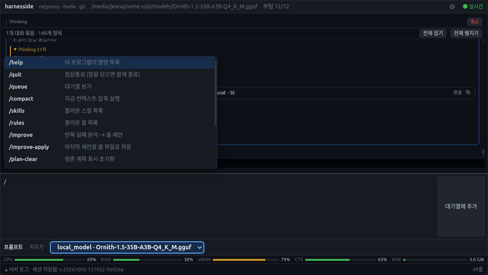

- `↑` `↓` 로 고르고 `Tab`/`Enter` 로 **완성**하고, `Esc` 로 닫는다
- 아래로 내려가면 **목록이 선택 항목을 따라간다**

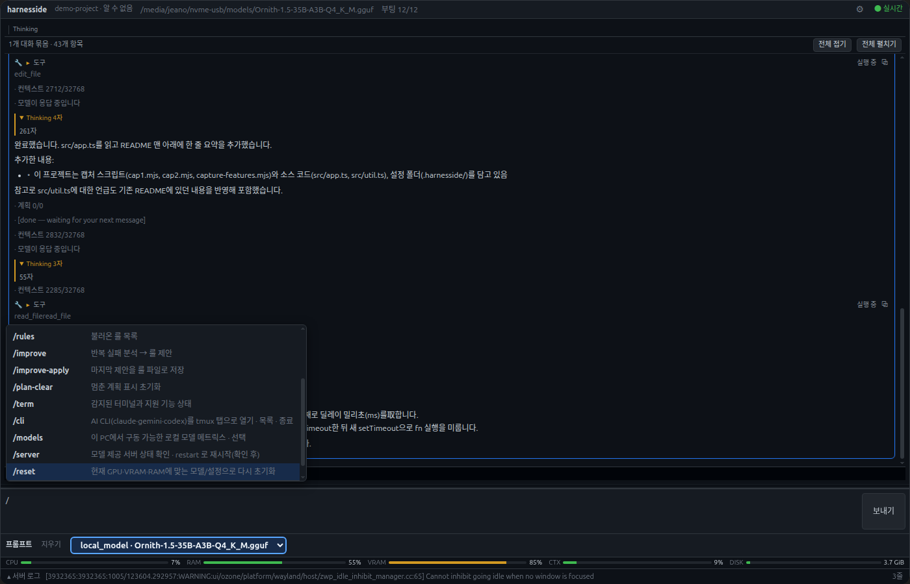

계측값: 항목 14개 · 한 줄 26px · 창 240px · 전체 384px.
9칸째(선택 항목이 234~260px)로 처음 스크롤이 움직여 `scrollTop` 이 21이 되었다.
**아직 보이는 구간에서는 움직이지 않는다** — 필요한 만큼만 움직이는 것이 의도다.

`/help` 를 실행하면 전체 목록이 **역할별로 묶여** 나온다.

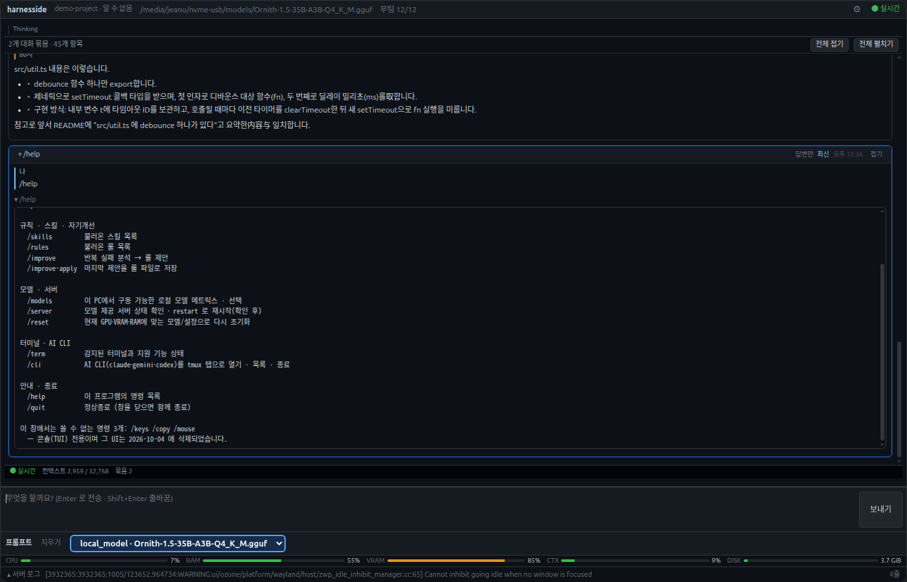

맨 아래 한 줄이 이 프로그램의 태도다.

```
이 창에서는 쓸 수 없는 명령 3개: /keys /copy /mouse
  — 콘솔(TUI) 전용이며 그 UI는 2026-10-04 에 삭제되었습니다.
```

조용히 없는 척 하지 않고 **몇 개와 무엇인지** 말한다.

#### 명령 전체 (웹 창에서 쓰는 14개 / 등록 17개)

| 명령 | 하는 일 |
|---|---|
| `/help` | 이 프로그램의 명령 목록 |
| `/models` | 이 PC 에서 구동 가능한 로컬 모델 목록 · 교체 |
| `/server` | 모델 제공 서버 상태 · `restart` 로 재시작 · `calibrate` 로 실측 재계산(확인 후) |
| `/reset` | 현재 GPU·VRAM·RAM 에 맞는 모델/설정으로 다시 계산 |
| `/term` | 감지된 터미널과 지원 기능 상태 |
| `/cli` | AI CLI 를 tmux 탭으로 열기 · 목록 · 종료 |
| `/skills` | 불러온 스킬 목록 |
| `/rules` | 불러온 룰 목록 |
| `/improve` | 반복 실패를 분석해 룰 제안 |
| `/improve-apply` | 마지막 제안을 룰 파일로 저장 |
| `/compact` | 지금 컨텍스트 압축 실행 |
| `/queue` | 대기열 보기 |
| `/plan-clear` | 멈춘 계획 표시 초기화 |
| `/quit` | 정상종료 (**15초 안에 두 번** — 확인 없이 끝내지 않는다) |

`/keys` · `/copy` · `/mouse` 는 등록되어 있으나 웹 창에는 없다.
이름은 지우지 않고 **이유와 함께** 남겼다 — 없는 명령을 찾는 사용자가 생기기 때문.

`/models` · `/server` · `/reset` · `/cli` 는 **인자가 필요한 명령**이라
입력을 치면 다음 단계 후보가 이어서 나온다(`1`·`2`·`confirm`).
바꾼다는 사실은 미리보기 → `confirm` 두 번으로 나눠 진다.

#### `/server calibrate` — 예측이 아니라 실측으로 다시 잡는다

설정의 `-ngl` · 컨텍스트 · `--n-cpu-moe` 는 카드·모델 크기로 낸 **예측**이다. `/server calibrate` 는
서버가 **떠 있는 상태에서** 실제 값을 재고 다시 계산한다.

| 잴 것 | 방법 |
|---|---|
| 카드에 남은 VRAM · 서버가 잡은 VRAM | `nvidia-smi` (pid 별) |
| KV 1토큰 비용 · 층 수 · 훈련 컨텍스트 | GGUF 헤더 |

같은 프롬프트, 같은 박스(RTX 2070 SUPER 8 GiB · Ornith 1.5 9B Q4_K_M)에서 보정 전후:

| | 오프로드 | 서버 VRAM | 카드 남음 | 프리필 | 생성 | 컨텍스트 |
|---|---|---|---|---|---|---|
| 보정 전 `-ngl 32 -c 36864` | `32/34` | 5,588 MiB | 2,064 MiB | 197.1 tok/s | 41.33 tok/s | 36,864 |
| 보정 후 `-ngl 999 -c 81920` | `34/34` | 6,808 MiB | 844 MiB | **482.5 tok/s** | **61.25 tok/s** | **81,920** |

규칙:

- **여유 VRAM 은 한 번만 쓴다.** `-ngl` 을 올리는 데 쓴 만큼은 컨텍스트가 쓸 수 없다.
- **안전 여유가 살아 있으면 줄이지 않는다.** 줄이는 것은 여유가 이미 깨졌을 때, 그 부족분만큼.
- **바뀌는 값은 미리보기 → `confirm`.** 새 설정으로 뜨지 않으면 직전 설정으로 다시 띄우고 config 에는 쓰지 않는다.
- **못 재면 바꾸지 않는다.** "바뀔 항목 없음"(최적)과 "측정할 수 없음"(모름)은 다른 문장이다.

`/server restart confirm` 과 `/models <n> confirm` 뒤에는 같은 보정이 자동으로 한 번 돈다.
설치 때 도는 `harnesside measure` 는 이 보정 위에서 **처리량**(스레드 수 등)을 비교한다.

### 3. 슬래시 명령의 실제 결과

명령은 **모델을 부르지 않는다.** 서버가 정본을 읽어 즉시 그린다.
그 여기가 이 프로그램의 편한 점이다.

**`/models` — 이 PC 에서 무슨 모델이 돌 수 있나**

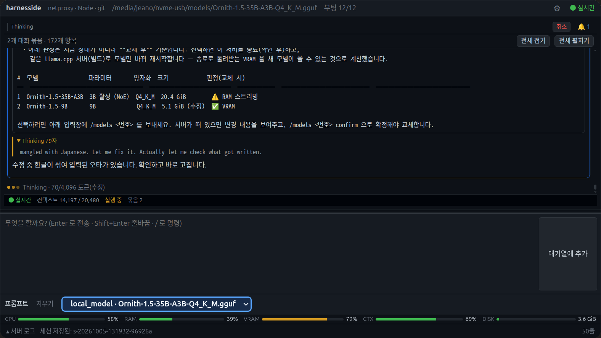

- **현재 실행 중인 모델**과 그 조건을 그대로 보여준다(포트 8080 · VRAM 6.1GiB 사용 ·
  `-ngl 999` · `--n-cpu-moe 33`)
- 목록에는 각 모델의 상태 배지가 붙는다 — 35B MoE 는 ⚠ **RAM 스터빙**, 9B 는 ✅ VRAM
- 고르면 **지금 서버를 내렸다 올리는 동작**이라서, 바꾼 뒤 무엇이 달라지는지 미리
  보여준 뒤 `confirm` 을 요구한다
- 교체는 `/models <번호>` → `confirm` 두 단계

**`/term` — 창이 스스로를 설명한다**

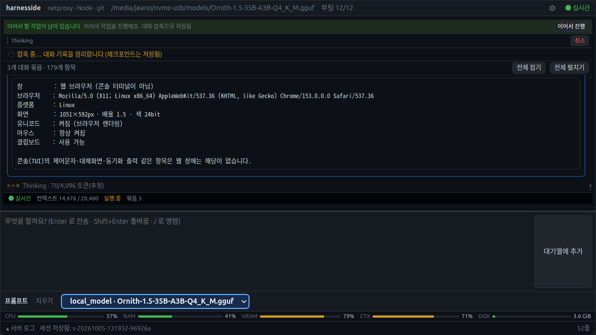

```
창          : 웹 브라우저 (콘솔 터미널이 아님)
브라우저    : ... Chrome/153.0.0.0 ...
화면        : 1400×860px · 배율 1 · 색 24bit
마우스      : 항상 켜짐
```

**`/skills` · `/rules` — 이 프로젝트가 무엇을 알고 있나**

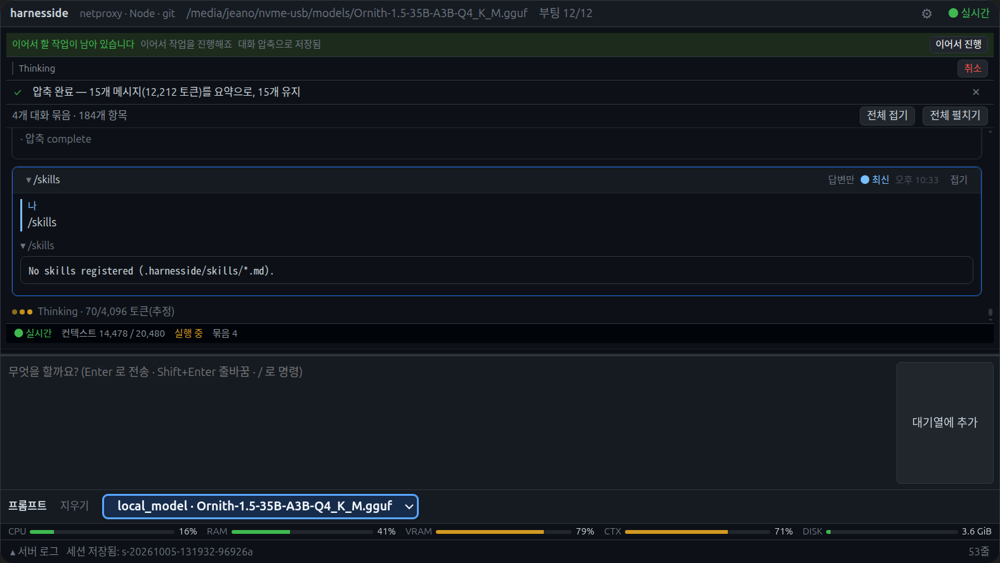

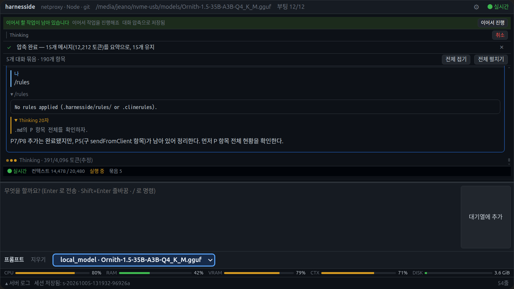

둘 다 `.harnesside/skills/*.md` · `.harnesside/rules/` 를 읽는다.
`.clinerules` 도 같이 본다. 파일이 없으면 **"없음"이라고 말한다** —
빈 목록을 "준비 완료"처럼 보여주지 않는다.

### 4. 설정 — 모델과 업데이트

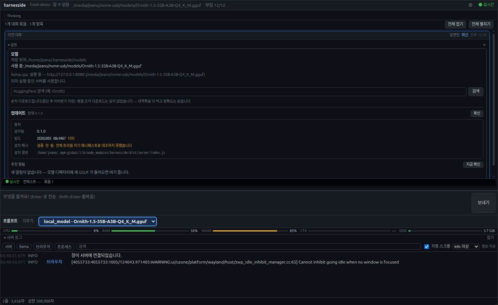

**모델**

- `저장 위치`와 `사용 중` 경로를 **따로** 보여준다 — 다르면 헷갈리니까
- `이미 실행 중인 서비스를 사용합니다` — **채택 경로**. 우리가 띄운 게 아닌 서버는
  **죽이지 않는다**. 부팅 로그에도 그 사실이 남는다
- HuggingFace 검색과 `순차 다운로드` 안내

**업데이트**

설치된 버전 · 빌드 신원(날짜 · 커밋) · **설치 해시** · 설치 경로를 보여준다. 설치 해시는 파일 하나가
아니라 설치 폴더의 `dist/` · `node_modules/` 전체를 `portable-manifest.json` 과 대조한 **트리 해시**다.
대조할 수 없으면(개발 실행 등) 0 이나 그럴듯한 해시로 메우지 않고 "검증 안 됨" 이라고 말한다.
트리가 깨끗하면 `더티` 라는 말을 출력하지 않는다 — 이상할 때만 말한다.
새 버전이 있으면 **이 머신용 zip 하나만** 버튼으로 보인다. (그림은 0.2.0 시점이다.)

### 5. 명령 팔레트

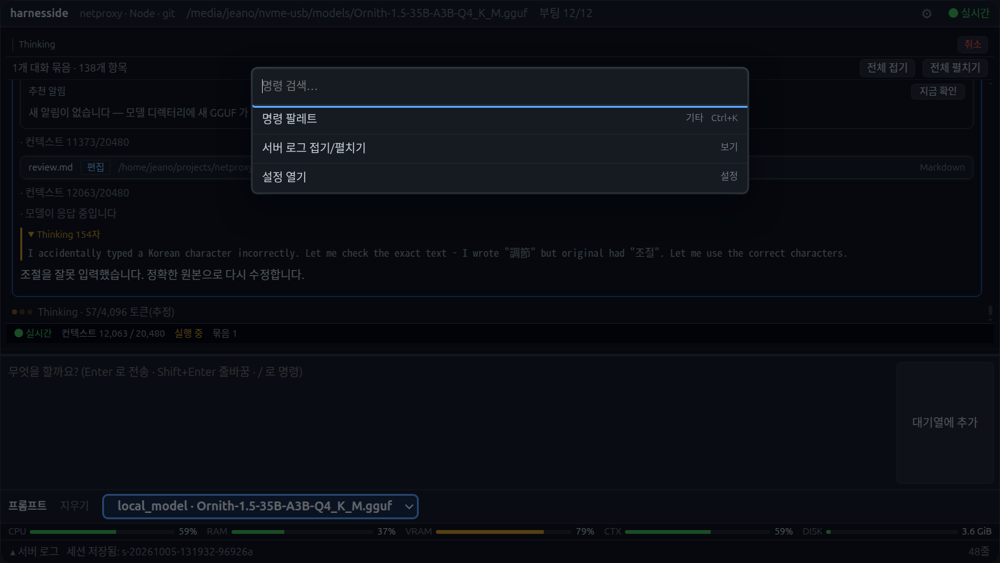

`Ctrl+K` 또는 `Ctrl+P`. 두 단축을 **같은 기능**에 걸었다 — "어느 쪽이 맞지" 하고
헤매지 않게. 그리고 이 시점의 팔레트 항목은 **3개뿐**이다(명령 팔레트 · 서버 로그 ·
설정). 더 적혀 있지 않은 것은 아직 없다는 뜻이다.

### 6. 서버 로그 — 부팅이 왜 그랬는지

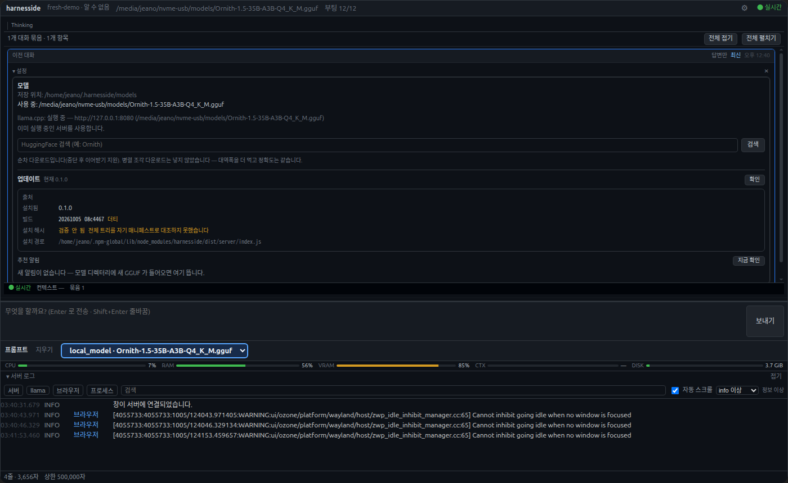

`▴ 서버 로그` 를 누르면 부팅 12단계를 **원문 그대로** 보여준다.
`서버 / llama / 브라우저 / 프로세스` 로 걸러내고, 수준과 줄 수를 좁힌다.
하단에 `4줄 · 3,656자 · 상한 500,000자` — **접어도 쌓이고 있는다**는 사실을
숫자로 말한다.

### 7. 에이전트에게 일시키기

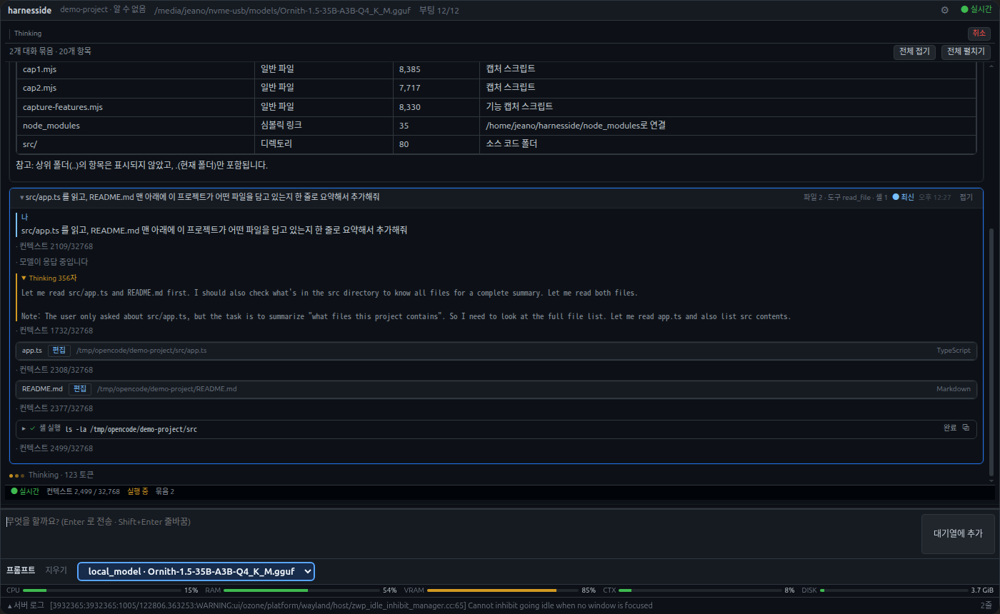

한 턴이 이렇게 보인다.

- 턴 머리말: 사람이 한 일 · `파일 2 · 도구 read_file · 최신` · 소요시간
- `Thinking 356자` — 추론을 **숨기지 않되 접을 수 있게** 보여준다
- 파일 칩 `app.ts 편집 · /…/src/app.ts · TypeScript` — 경로와 언어를 함께
- `✓ 셸 실행 ls -la … /tmp/opencode/demo-project/src` · `완료` 배지
- `컨텍스트 1,732/32,768` — 도구 호출마다 숫자가 움직이는 것이 보인다
- 실행 중에는 보내기 버튼이 `대기열에 추가`로 바뀐다 — **거절하지 않고 받는다**

이어서 실제로 고친 결과.

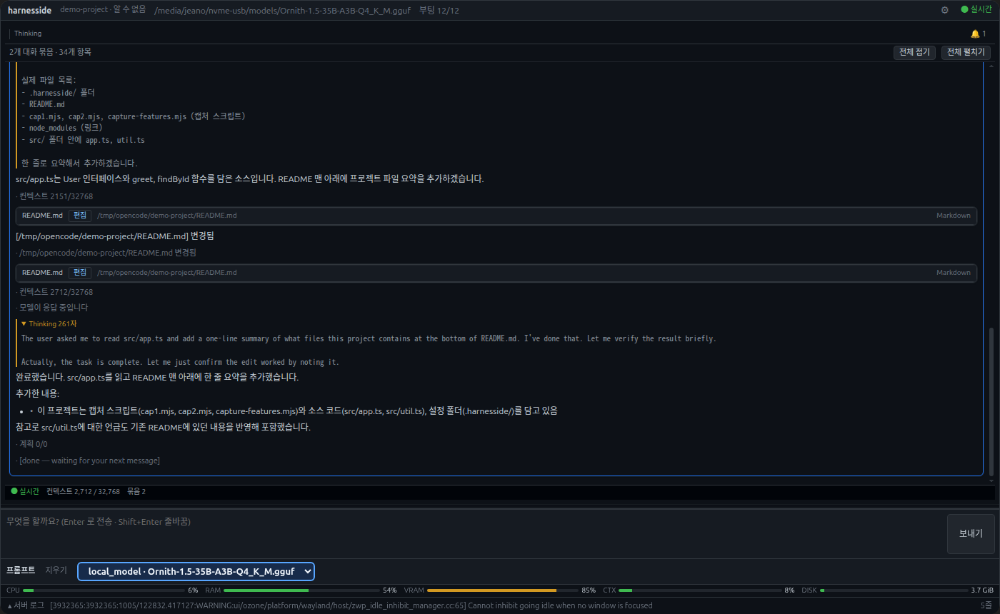

이 그림에서 **35B 모델이 지운 파일을 목록에 넣었다.** 화면은 그 사실을 덮지 않고
`edit_file` 이 무엇을 썼는지 그대로 보여준다. 모델의 실수를 숨기는 화면은
도움이 되지 않는다 — **사용자가 직접 확인할 수 있어야 한다.**

셸 실행만 떼어 보면 이렇다.

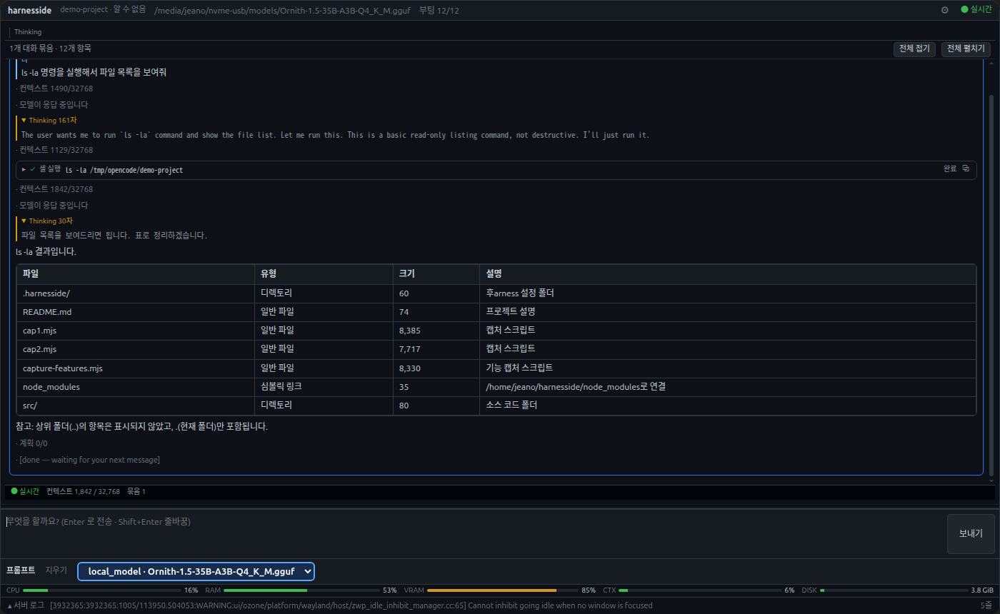

`원본` / `답` 으로 **모델이 본 것과 실제 출력을 따로** 열어본다.
마크다운 표도 렌더링된다.

### 8. 파일 열기와 편집

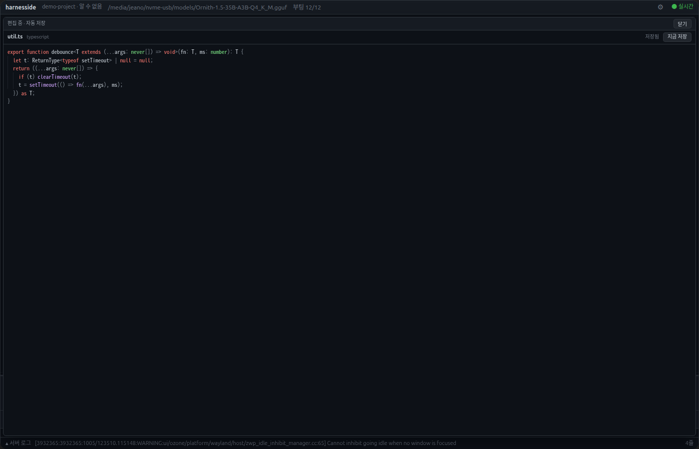

도구 호출 칩의 `편집` 을 누르면 열린다. **별도 패널이 아니라 대화 위에 겹친다.**
`편집 중 · 자동 저장` · `저장됨 (버전)` · 탭에 경로와 언어 · `닫기`.

**자동 저장**이 실제로 돈다 — 입력을 멈추면 1.5초 뒤에 PUT 으로 디스크에 쓰이고
헤더가 `저장됨 (v…)` 으로 바뀐다(계측: 2.5초 안에 디스크 반영 확인).

**바깥에서 파일을 고친 경우** — 두 갈래로 갈린다. 손댄 것과 안 손댄 것의 결과가
다르기 때문이다.

- **손대지 않았다면** → 디스크를 따른다(계측: 2초 만에 반영)
- **고치는 중이라면** → **덮어쓰지 않는다.** 자동 저장이 서버의 새 버전을 보고
  409 를 받으면 **자동 덮어쓰지 않는다** 고 말하며 선택지를 내놓는다

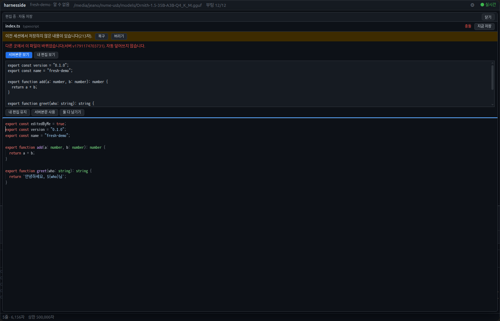

```
다른 곳에서 이 파일이 바뀌었습니다(서버 v1791174703731). 자동 덮어쓰지 않습니다.
[서버본문 보기] [내 편집 보기]      ← 둘 다 눈으로 확인
[내 편집 유지] [서버본문 사용] [둘 다 남기기]
```

버전 번호까지 같이 보여준다 — "누가 언제 바꿨는지"가 아니라 **지금 어느 버전이
기준인지** 를 말해 충돌을 곧바로 해결하게 한다. 두 본문을 먼저 눈으로 비교하는
버튼이 위에 있는 이유다.

### 9. 프롬프트 대상 — 로컬 모델과 AI CLI

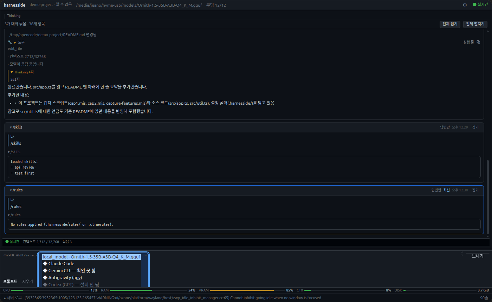

기본은 **이 PC 의 로컬 모델**이다. 고르면 사용자 환경에 이미 있는 AI CLI 로 보낼 수
있고, tmux 탭으로 띄워 함께 쓴다.

```
◆ Claude Code
◆ Gemini CLI — 확인 못 함
◆ Antigravity (agy)
◆ Codex (GPT) — 설치 안 됨
```

`설치 안 됨` 과 `확인 못 함` 은 **다른 상태**다. 전자는 **알고 있고 없는 것**이고,
후자는 **모르는 것**이다. 둘을 같은 말로 뭉개지 않는다.

### 10. 좁은 창

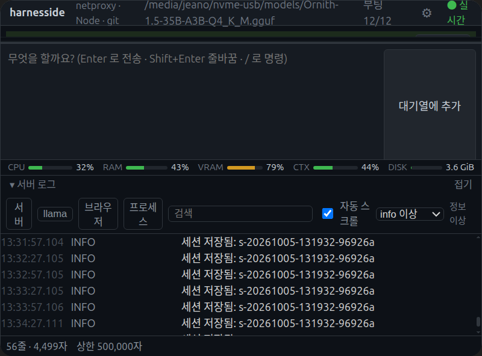

800px 에서 가로 스크롤이 생기지 않는다(계측: `scrollWidth <= clientWidth`).
1600×1000 으로 띄우는 Chrome 창이 아니라 **창 자체가 줄어드는** 경우다.

### 11. 두 개를 동시에 띄울 때

프로젝트마다 `.harnesside/` 상태가 따로이므로 **인스턴스도 따로**다.
그리고 각 인스턴스는 **자기 CDP 포트와 자기 Chrome 프로필**을 가진다.

실측: 사용 중인 프로젝트 7317 · 이 문서를 만든 프로젝트 7318 · 새 프로젝트 7319,
CDP 는 9222 · 9223 · 9224 로 전부 분리됐다.

CDP 포트를 **이름으로 지정하지 않으면** 비어 있는 포트를 찾아 쓴다.
`HARNESSIDE_CDP_PORT` 로 지정했는데 그 포트를 이미 다른 인스턴스가 쓰고 있으면
**조용히 바꾸지 않고 멈춘다** — 엉뚱한 창을 띄우는 것보다 안 뜨는 게 낫다.

### 자주 하는 일 → 하는 법

| 하고 싶은 것 | 하는 법 |
|---|---|
| 파일 찾기 | "최신 변경 파일을 찾아" · "테스트를 실행하고 실패한 건만 정리해줘" |
| 코드 이해 | "src/app.ts 를 읽고 이 함수가 하는 일을 설명해줘" → 칩의 `편집` 으로 소스 보기 |
| 고치기 | "… 바꿔줘" → `edit_file` 결과를 확인 → 안 맞으면 "그 부분을 되돌려줘" |
| 실측하기 | "ls -la 실행해서 보여줘", "테스트를 돌려줘" |
| 중간에 정리 | `/compact` · 긴 일이 되면 자동 압축이 먼저 도는 중 |
| 기다리는 동안 | 보내기 버튼이 `대기열에 추가`가 됨 · `/queue` 로 순서 보기 |
| 키보드 없이 명령 찾기 | `Ctrl+K` · 슬래시는 입력창에서 `/` |

### 추론 예산이 초과되면 무슨 일이 벌어지나

본턴에서 모델이 **생각만 하다가 아무것도 안 하는** 것을 막으려고 상한이 있다.
초과하면 **이번 턴을 "생각" 에서 "직접 도구 호출" 로 전환한다.** 상한은
`.harnesside/config.yaml` 의 `agent.maxReasoningTokens` 로 정한다.

```
추론 예산 초과 → 도구 호출로 전환 (66/64·추정)
```

무엇이 일어났는지 · 다음에 무엇을 할 것인지 · 그 값이 추정치라는 사실을 함께 말한다.

### 입력창 — 안내문 · 높이 · 히스토리

입력창은 두 가지 정보를 **안내문에 담아서** 보여준다.

```
무엇을 할까요? (Enter 로 전송 · Shift+Enter 줄바꿈 · / 로 명령 · ↑↓ 지난 프롬프트)
```

- `/ 로 명령` — 슬래시 명령 14개를 입력창에서 바로 찾는다
- `↑↓ 지난 프롬프트` — 프롬프트를 하나라도 보낸 뒤에만 붙는다

**높이 기본값은 2줄(104px)** 이고 손잡이로 줄 단위(18px)씩 조절한다. 최소는 1줄(70px).

### 단축키

| 키 | 동작 |
|---|---|
| `Enter` | 전송 · 슬래시 메뉴가 켜져 있으면 **먼저 완성** |
| `Shift+Enter` | 줄바꿈 |
| `Ctrl+K` · `Ctrl+P` | 명령 팔레트 |
| `↑` `↓` | **프롬프트 히스토리** — 지난 말을 되살린다 (아래 절) |
| `↑` `↓` (메뉴가 열렸을 때) | 슬래시 후보 이동 — **히스토리보다 우선한다** |
| `Tab` | 후보를 입력창에 완성 |
| `Esc` | 메뉴 · 팔레트 닫기 |
| `Alt+` `←` `→` `↑` `↓` | 패널 이동 |

### 프롬프트 히스토리 — `↑` `↓`

입력창에서 `↑` 를 누르면 **지난 프롬프트가 되살아난다.** `↓` 는 반대로 가고,
최신 다음에 닿으면 **브라우즈하기 전에 쓰던 반쯤 쓴 문장**이 돌아온다.

셸처럼 무조건 과거로 대는 것은 하지 않는다. **커서가 있는 줄을 먼저 본다.**

- `↑` 는 커서가 **첫 줄**일 때만 과거로 간다
- `↓` 는 커서가 **마지막**일 때만 다음으로 간다

그래서 두 줄로 쓴 프롬프트 **본문을 고치는 중에 과거가 끼어들지 않는다.**
기능을 넣으면서 편집을 망치는 일은 없다.

`/` 를 치면 슬래시 메뉴가 뜨는데, 그때 `↑` `↓` 는 **후보 이동**이다 — 더 좁고 더 급한
요구이므로 언제나 먼저다. 메뉴를 `Esc` 로 닫으면 곧바로 히스토리가 된다.

연속으로 같은 말을 두 번 보낸 것은 **한 번만** 꺼낸다. 하지만 떨어져 나온 중복은
**지우지 않는다** — "1번 · 2번 · 1번" 은 셋 다 실제로 보낸 말이다.

## 구조

파일시스템에서 다시 뽑았다 (**2026-10-07**, v0.4.0). LOC 는 테스트(`*.test.ts`) 제외,
테스트는 `*.test.ts` 파일 **191개 · 케이스 2323개**다.

```
src/  50,195 total (non-test)
  server/     14,197  데몬: 12단계 부팅, HTTP 라우트, WS 허브, 터미널/PTY, 승인 게이트,
                        업데이터(포터블 zip), tmux CLI 호스팅
  setup/      12,634  하드웨어·CPU·셸 감지, 엔진 사다리, 모델 카탈로그/다운로드,
                        튜닝, calibration, 설치 시 실측(measure)
  web/        11,515  Chrome 창의 React SPA: 에이전트 패널, IDE 프레임, 편집기, 계측, 설정
  agent/       2,474  턴 루프: 도구 호출 스트림, 재시도/반복 감지, 계획 진행
  backend/     1,439  OpenAI 호환 클라이언트 + llama-server 프로세스 관리·감지·채택
  tools/         987  read/write/edit/run_shell, diff 렌더링, CDP 브라우저 도구
  models/        983  허깅페이스 검색, 하드웨어 적합도 점수, 재개 가능 다운로드
  compaction/    944  컨텍스트 요약, 체크포인트, 지속되는 노트
  session/       903  대화 블록(정본), 세션 저장, 자동 저장
  shared/        846  import 0개인 순수 데이터: 슬래시 명령, CLI 프로바이더, 계측 포맷
  config/        793  설정 스키마, 각 값의 출처(provenance)
  git/           506  status/diff/commit/push — redact + 충돌 시 중단
  fs/            501  루트 이탈 방지 경로 가드, 저장소 전체 검색
  hermes/        229  회로차단기, 실패 로그, 룰 제안 루프
  auth/          213  bearer 토큰, 루프백 서버의 Host/Origin 허용 목록
  skills/        207  기존 AI CLI 컨벤션 8종에 대한 rule/skill 탐색
.harnesside/          프로젝트별 상태 (git ignore 대상)
  config.yaml         백엔드/모델/튜닝/컴팩션 설정
  rules/ · skills/    프로젝트 규칙 · 트리거 기반 스킬
  state/              체크포인트, 인스턴스 락, 서버 로그, 실측 기록
~/.harnesside/        머신 단위: 모델, 엔진 사전 빌드, machine-profile.json
```

재현:

```bash
find src -name '*.ts' -o -name '*.tsx' | grep -v '\.test\.ts$' | xargs wc -l | tail -1   # 50195
find src scripts -name '*.test.ts' | wc -l                                               # 191
```

설계 근거 · 모듈 해설 · Hermes 루프: [`docs/ARCHITECTURE.md`](docs/ARCHITECTURE.md).

## 빌트인 스킬

`src/skills/builtin/` 은 고정 스킬 **9개**를 싣는다: `architecture-design` · `planning` ·
`implementation` · `code-review` · `whitebox-testing` · `blackbox-testing` · `static-analysis` ·
`security` · `web-publisher`. 각각 일반 skill 파일(트리거 + 본문)이라 프로젝트의
`.harnesside/skills/*.md` 로 덮어쓰거나 추가할 수 있다.

**`/skills` 에는 나오지 않는다.** 그 명령은 프로젝트의 `.harnesside/skills/*.md` 만 보여준다.
빌트인은 **모델 쪽으로** 간다 — 색인이 시스템 프롬프트에 붙고, 모델이 `load_skill` 로 본문을 불러온다.

## 릴리스와 업데이트

버전은 **두 층**이다. 릴리스 식별자는 SemVer(`package.json`), 빌드 신원은 **날짜+커밋**이고
릴리스마다 코드에 구워진다(설치된 배포물에는 git 저장소가 없어서 커밋을 물을 수 없다).

```
릴리스 식별자   0.4.0              ← package.json. 정본. 업데이트 비교가 본다.
빌드 신원       20261006-d29496e   ← dist/server/buildInfo.json. 화면·로그·검증이 본다.
```

설계 배경은 [PROMPT_RELEASE_SELFUPDATE.md](PROMPT_RELEASE_SELFUPDATE.md),
플랫폼·엔진 확장 계획은 [PROMPT_PLATFORM_ENGINES.md](PROMPT_PLATFORM_ENGINES.md).

### 배포물 — 포터블 zip 하나

```bash
npm run portable                              # build + release/harnesside-portable-<platform>-<arch>.zip
node scripts/make-portable.mjs --verify-repro # 두 번 만들어 바이트가 같은지 (재현성)
cd release && sha256sum -c harnesside-portable-*.zip.SHA256SUMS
```

| 파일 | 내용 |
|---|---|
| `harnesside-portable-<p>-<a>.zip` | 설치 폴더 전체: `dist/` · 프로덕션 `node_modules/` · 런처 · 설치 스크립트 · `portable-manifest.json` |
| `….zip.manifest.json` | 위 매니페스트 + **zip 자신의 sha256** — zip 안의 매니페스트는 자기 zip 해시를 담을 수 없다 |
| `….zip.SHA256SUMS` | `sha256sum -c` 용 |

zip 은 **재현 가능**하게 쓴다(정렬된 순서 · 고정 시각 · 외부 zip 바이너리 없음).
`node_modules` 에 네이티브 모듈이 있으므로 zip 은 **그 플랫폼 러너에서** 만든다.

### 게시

`v*` 태그를 push 하면 `.github/workflows/release.yml` 이 돈다. 선행 게이트
(typecheck · 단위 테스트 · 정적 검사 · 커버리지 하한선 · **재현성** · **셀프업데이트
실측**)를 통과해야 플랫폼별 zip 을 만든다:

| 플랫폼 | 러너 | 필수 | v0.4.0 |
|---|---|---|---|
| `linux-x64` | `ubuntu-latest` | 예 | 빌드·풀어서 실행 통과 |
| `win32-x64` | `windows-latest` | 예 | 〃 |
| `linux-arm64` | `ubuntu-24.04-arm` | 아니오 | 〃 |
| `win32-arm64` | `windows-11-arm` | 아니오 | 〃 |
| `darwin-arm64` | `macos-15` | 아니오 | 〃 |
| `darwin-x64` | `macos-15-intel` | 아니오 | 〃 |

각 러너는 zip 을 만든 뒤 **풀어서** 설치 점검 · `node-pty` 로드 · `--version` · `doctor` 를
돌린다. 필수 플랫폼이 실패하면 게시하지 않고, 선택 플랫폼이 실패하면 릴리스 노트에
**실패했다고** 적고 그 zip 을 싣지 않는다. **브랜치 푸시로는 만들어지지 않는다.**

### 업데이트가 실제로 무엇을 바꾸나

- 자기 `<platform>-<arch>` zip 만 받는다. 다른 플랫폼 zip 이나, 이름은 맞지만 매니페스트가
  다른 플랫폼을 선언한 zip 은 **받기 전에** 거부한다.
- **교체는 설치 폴더의 `dist/` 와 `node_modules/` 전체**다. 의존 모듈도 새 버전과 함께
  온다. 새 트리에 없는 옛 파일은 이 두 폴더 안에서 정리한다.
- 설치 폴더 안의 **사용자 상태(`.harnesside/`)와 사용자 파일은 건드리지 않는다.**
  롤백 슬롯도 배포물 범위만 담는다.
- **검증 전에는 어떤 파일도 덮어쓰지 않는다.** 매니페스트 수신 → zip 수신 → 해시 대조 →
  풀기 → 목록 대조, 를 전부 통과한 것만 슬롯으로 간다. 바뀌지 않은 파일은 다시 쓰지 않고,
  Windows 에서 실행 중이라 잠긴 네이티브 모듈은 비켜 두고 교체한다.
- 설치 폴더가 git 체크아웃이면 적용하지 않는다.
- **수동 실행만** 한다. **자동 롤백은 없다** — 이 서버는 자기 자신을 재시작할 수
  없으므로, 부팅이 확인되지 않으면 다음 실행이 "업데이트 미확인" 으로 알리고 슬롯 경로를 남긴다.
- 0.3.x 이하(tar.gz 셀프업데이트) 설치본은 0.4.0 을 자동으로 받지 못한다 — zip 을 받아 새로 설치한다.

### 반드시 알아야 할 것

**해시는 코드 서명이 아니다.** 해시는 *바이트가 손상되지 않았다* 는 사실과,
*이 바이트가 어느 커밋·어느 시각에 만들어졌다* 는 사실을 증명한다. **그 바이트가
신뢰할 수 있는지** 는 증명하지 못한다. 저장소 계정이 탈취되면 공격자는 자기 코드와
맞는 해시를 다시 계산할 수 있다.

### 직접 확인하기

```bash
npm run verify:selfupdate
```

네트워크 0회로 전체 경로를 실제 포터블 zip 으로 굴린다: 빌드 A 설치 → B 를 받아 검증 →
적용(의존 모듈 포함) → 되돌리고 **바이트 단위로** A 와 같은지, 설치 폴더 안 사용자 상태가
그대로인지, 해시를 한 글자 바꾼 자산과 다른 플랫폼 zip 이 **아무것도 교체하지 않는지**,
네트워크가 죽었을 때 "최신" 으로 **말하지 않는지**를 본다.


## 개발

체크아웃에서 실행하는 것은 개발용이다 — 설치 경로가 아니다.

```bash
npm ci
npm run dev                 # 서버 :7317 + Vite :5317, 둘 다 watch
npm test                    # 단위 테스트 (node:test, tsx)
npm run typecheck
npm run portable            # build + release/harnesside-portable-<platform>-<arch>.zip
npm run verify:selfupdate   # 포터블 zip 으로 셀프업데이트 전체 경로 실측
```

## 검증

무엇을 실제로 확인했고 무엇을 확인하지 않았는지, 그리고 측정값:
**[docs/VERIFICATION.md](docs/VERIFICATION.md)** · 플랫폼별 실측:
**[docs/PLATFORM_MATRIX.md](docs/PLATFORM_MATRIX.md)**. 여기 인용된 숫자를 믿기 전에 먼저 읽는다.

설계 근거 · 모듈 해설 · 버그 이력:
**[docs/ARCHITECTURE.md](docs/ARCHITECTURE.md)** ·
**[docs/IMPLEMENTATION-HISTORY.md](docs/IMPLEMENTATION-HISTORY.md)**
