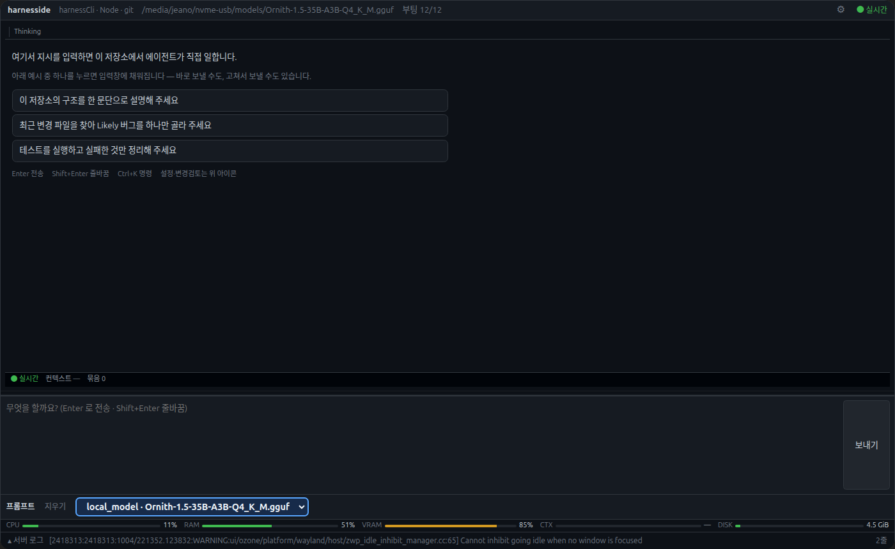

# harnesside

An AI coding agent CLI that talks to a local llama.cpp backend directly and is
fully compatible with the OpenAI Chat Completions API. See
[`PROMPT.md`](./PROMPT.md) for the full design background and requirements.

> 로컬 llama.cpp를 직접 호출하며 OpenAI Chat Completions API와 호환되는 AI 코딩 에이전트
> CLI입니다. 설계 배경과 전체 요구사항은 [`PROMPT.md`](./PROMPT.md)를 참고하세요.

## Screens



실제 창의 캡처다(2026-10-04, 1400×860). 서버가 띄운 Chrome 창에서 CDP `Page.captureScreenshot` 으로
찍었다 — `scripts/capture-window.mjs` 와 같은 방법이며, **README 의 화면은 이 방법으로만 만든다**.
사람이 그린 그림은 넣지 않는다.

예전 이 절은 구 Ink TUI 를 `scripts/capture_screens.py`(pty 재생)로 찍은 텍스트 프레임이었다.
TUI 가 삭제되면서(Q-2, 2026-10-04) 그 스크립트가 실행하던 바이너리가 없어져 **다시 만들 수 없는**
캡처가 됐으므로, 스크립트와 `docs/screenshots/*.txt` 를 함께 지웠다. 되살리려면 `git log -- scripts/capture_screens.py`.

## What this program is

harnesside is a single-binary terminal coding agent. It reads a prompt, streams a
reply from a local LLM, and executes the tools that reply asks for — reading
and writing files, running shell commands, diffing, and driving a browser over
CDP — looping until the model stops asking for tools. It is deliberately built
around a **local** llama.cpp server rather than a hosted API, so the entire
loop (model weights, conversation history, every file the agent reads) stays on
one machine.

Three things follow from that, and they explain most of the design:

1. **It is a long-running process, not a request/response tool.** A turn can
   take minutes of CPU-bound generation. That is why context is compacted
   automatically rather than being allowed to overflow, why work is
   checkpointed to disk between tool calls, and why a crash has to be
   recoverable on the next launch.
2. **Memory is the scarce resource, not disk.** The model file is tens of
   gigabytes and the machine is not a datacenter. Every subsystem that can
   hold memory has an explicit budget, and the failure mode to design against
   is a host that gets slow and then kills the wrong process.
3. **The UI is a fixed-size grid painted with escape sequences.** The whole
   TUI assumes it knows exactly how many terminal columns and rows it has,
   because it positions the real hardware cursor by absolute row/column. Any
   change that makes a line's real width differ from the width the layout
   budgeted for is a visual bug, not a cosmetic one.

### Request flow

```
keystroke
  └─ App.tsx (Ink)  input box, slash menu, status bar
       └─ AgentLoop.send()
            ├─ check context usage  ─── over threshold ──▶ compact()
            │                                                   │
            │                                     summarize + write checkpoint
            │                                     to .harnesside/state/, resume
            ▼                                                   │
        POST /v1/chat/completions  ──▶ llama-server ──▶ tool_calls?
            │                                                   │
            │                                     yes ─────────┘
            │                                     execute via tools/index.ts
            │                                     (read/write/edit/shell/diff/browser)
            │                                     append results to the transcript
            ▼                                     loop back with the results
        streamed text ──▶ markdown render ──▶ log pane
```

Every hop in that loop has a failure mode that has already bitten this
codebase, and each is documented at its call site and covered by a test. The
`## Implementation status` section below is the running list.

### The subsystems

| Area | Entry point | Responsibility |
|---|---|---|
| Web UI | `src/web/main.tsx` | Prompt, conversation blocks, command palette, AI CLI target (replaced the deleted Ink TUI `tui/App.tsx`) |
| Terminal capabilities | `src/setup/terminal.ts` | What this process may emit, per terminal (bootstrap progress) |
| Keybindings | `src/web/main.tsx` | Command palette shortcuts (the TUI's `tui/keybindings.ts` was deleted with the TUI) |
| Agent loop | `src/agent/loop.ts` | Turn driving, tool dispatch, context accounting |
| Compaction | `src/compaction/` | Checkpoint write/resume, history summarization |
| Self-healing | `src/hermes/` | Failure log, circuit breaker, improvement proposals |
| Backend | `src/backend/` | llama-server process management, OpenAI-compatible client |
| Tools | `src/tools/` | `read_file` / `write_file` / `edit_file` / `run_shell` / `browser_*` |
| Skills & rules | `src/skills/` | Always-on rules, lazily-loaded skills |
| Update | `src/server/updateService.ts` | GitHub Releases check, hash-verified slot swap, boot check, rollback (one path — Q-7) |
| Crash handling | `src/crashHandler.ts` | Synchronous crash log + terminal restore |

`src/setup/terminal.ts` and `src/server/updateService.ts` are
the most recent additions and the ones with the sharpest edges — see the
developer guide below before changing them.

> ## 이 프로그램이 무엇인가
>
> harnesside는 단일 바이너리 터미널 코딩 에이전트입니다. 프롬프트를 받아 로컬 LLM
> 응답을 스트리밍하고, 그 응답이 요구하는 도구(파일 읽기/쓰기, 셸 실행, diff,
> CDP 브라우저 제어)를 실행하며, 모델이 도구를 더 요구하지 않을 때까지
> 반복합니다. 호스팅 API가 아니라 **로컬 llama.cpp** 를 전제로 만들기 때문에
> 모델 가중치·대화 기록·에이전트가 읽은 모든 파일이 한 머신 안에 남습니다.
>
> 여기서 대부분의 설계가 설명됩니다.
>
> 1. **요청-응답 도구가 아니라 오래 사는 프로세스입니다.** 한 턴이 수 분의
>    CPU 바운드 생성을 걸칠 수 있습니다. 그래서 컨텍스트를 자동 압축하고,
>    도구 호출 사이마다 체크포인트를 디스크에 남기며, 다음 실행에서 복구될 수
>    있어야 합니다.
> 2. **부족한 자원은 디스크가 아니라 메모리입니다.** 모델 파일이 수십 GB이고
>    머신은 데이터센터가 아닙니다. 메모리를 잡을 수 있는 서브시스템마다 예산이
>    명시되어 있고, 설계 대상 실패 모드는 "느려진 머신이 잘못된 프로세스를
>    죽이는 것" 입니다.
> 3. **UI는 탈출문자열로 칠하는 고정 크기 격자입니다.** TUI 전체가 터미널의 열과
>    행 수를 정확히 안다고 가정합니다. 실제 커서를 절대 좌표로 이동시키기
>    때문입니다. 줄의 실제 폭이 레이아웃이 예산한 폭과 달라지는 변경은
>    장식이 아니라 버그입니다.

## Structure

Regenerated from the filesystem (2026-10-04, Q-12). LOC excludes tests; the
test count is the number of `*.test.ts` files. `tui/` and `localstack/` are
**gone** — the Ink TUI was deleted (Q-2) and the forked setup tree was merged
back into `setup/` (Q-1).

```
src/
  server/     10,975  the daemon: 12-step boot, ~70 HTTP routes, WS hub,
                         terminal/PTY, approval gate, updater, tmux CLI hosting
  setup/      10,823  hardware + tuning + port planning, llama.cpp build and
                         launch, model catalogue/download/provisioning, the
                         12-step `ensureLocalStack` ladder
  web/         9,763  the React SPA served into the Chrome window: agent panel,
                         IDE frame, terminal (xterm), monitors, settings
  agent/       2,124  the turn loop: tool-call stream, retry/repeat detection,
                         plan progress, salvaging truncated tool calls
  backend/     1,421  OpenAI-compatible client + llama-server process manager
  tools/         987  read/write/edit/run_shell, diff rendering, CDP browser tools
  models/        983  HuggingFace search, hardware-fit scoring, resumable download
  session/       903  conversation blocks (canonical), session store, autosave
  compaction/    879  context summarisation, checkpoints, durable notes
  config/        788  settings schema, provenance (where each value came from)
  shared/        625  zero-import pure data: slash commands, CLI providers,
                         metrics formatting, symbols, search ranking
  git/           506  status/diff/commit/push with redaction and conflict stop
  fs/            501  root-escaping path guards, repo-wide search and ranking
  hermes/        229  circuit breaker, failure log, rule-proposal loop
  auth/          213  bearer token, Host/Origin allowlist for the loopback server
  skills/        207  rule/skill discovery across 8 existing AI-CLI conventions
.harnesside/          per-project state (git-ignored)
  config.yaml         backend/model/compaction settings
  rules/              always-applied project rules
  skills/             trigger-based, lazily-loaded skill docs
  state/              runtime checkpoint, instance lock, server log
```

Design rationale, the module map in prose, terminal capability detection, and
the Hermes loop: [`docs/ARCHITECTURE.md`](docs/ARCHITECTURE.md).

> ## 구조
>
> 파일시스템에서 다시 뽑았다 (2026-10-04, Q-12). LOC 는 테스트 제외, 테스트 수는
> `*.test.ts` 파일 개수다. `tui/` 와 `localstack/` 는 **사라졌다** — Ink TUI 는
> 삭제되었고(Q-2), 복제되어 있던 setup 트리는 `setup/` 으로 합쳐졌다(Q-1).
>
> ```
> src/
>   server/     10,975  데몬: 12단계 부팅, HTTP 라우트 약 70개, WS 허브,
>                          터미널/PTY, 승인 게이트, 업데이터, tmux CLI 호스팅
>   setup/      10,823  하드웨어·튜닝·포트 계획, llama.cpp 빌드와 기동,
>                          모델 카탈로그/다운로드/프로비저닝, 12단계 ensureLocalStack
>   web/         9,763  Chrome 창에 제공되는 React SPA: 에이전트 패널, IDE 프레임,
>                          터미널(xterm), 계측, 설정
>   agent/       2,124  턴 루프: 도구 호출 스트림, 재시도/반복 감지, 계획 진행,
>                          잘린 도구 호출 복구
>   backend/     1,421  OpenAI 호환 클라이언트 + llama-server 프로세스 관리
>   tools/         987  read/write/edit/run_shell, diff 렌더링, CDP 브라우저 도구
>   models/        983  허깅페이스 검색, 하드웨어 적합도 점수, 재개 가능 다운로드
>   session/       903  대화 블록(정본), 세션 저장, 자동 저장
>   compaction/    879  컨텍스트 요약, 체크포인트, 지속되는 노트
>   config/        788  설정 스키마, 각 값의 출처(provenance)
>   shared/        625  import 0개인 순수 데이터: 슬래시 명령, CLI 프로바이더,
>                          계측 포맷, 심볼, 검색 랭킹
>   git/           506  status/diff/commit/push — redact + 충돌 시 중단
>   fs/            501  루트 이탈 방지 경로 가드, 저장소 전체 검색과 랭킹
>   hermes/        229  회로차단기, 실패 로그, 룰 제안 루프
>   auth/          213  bearer 토큰, 루프백 서버의 Host/Origin 허용 목록
>   skills/        207  기존 AI CLI 컨벤션 8종에 대한 rule/skill 탐색
> .harnesside/          프로젝트별 상태 (git ignore 대상)
>   config.yaml         백엔드/모델/컴팩션 설정
>   rules/              항상 적용되는 프로젝트 규칙
>   skills/             트리거 기반 지연 로딩 skill 문서
>   state/              런타임 체크포인트, 인스턴스 락, 서버 로그
> ```
>
> 설계 근거 · 모듈 해설 · 터미널 capability 감지 · Hermes 루프:
> [`docs/ARCHITECTURE.md`](docs/ARCHITECTURE.md).

## Getting started

**One install path. There is no second one.**

```bash
npm install -g harnesside
harnesside
```

That is the whole thing. On first launch `harnesside` provisions whatever is
missing — llama.cpp, a model, the ports — and says which step it is on. When it
cannot do something it says **which step, what failed, why, and what to do next**
rather than opening a blank window. `harnesside doctor` runs the same checks
read-only, before anything is changed.

Requires **Node 22+** (`engines`). Node 20 was measured and does not work:
`node-pty` dies with SIGSEGV on exit and there is no global `WebSocket` before
Node 22. See the runtime matrix below.

Per-project state follows your working directory: each project gets its own
`.harnesside/config.yaml`, `rules/` and `skills/`. The global command is only the
entry point — per-project state stays in that project. Verified from this repo
and from an unrelated directory (the status bar's `cwd` reflects wherever you
launched it, and a project with no rule/skill convention gets a default rule
generated in place).

To uninstall: `npm rm -g harnesside` (from anywhere).

<details>
<summary>Working on harnesside itself, or running from a checkout</summary>

```bash
git clone https://github.com/jeano76/harnesside && cd harnesside
npm install
npm run dev          # server on :7317 + Vite on :5317, both watch
npm test             # unit tests (node:test via tsx)
npm run typecheck
npm run build        # required before `harnesside` can run from dist/
node dist/server/index.js     # same binary the global install runs
```

`npm link` also works and is what local testing uses, but it is **not** the
documented install — it leaves a symlink into your checkout, so a later
`git checkout` can silently change what the global `harnesside` runs.

</details>

> ## 시작하기
>
> **설치 경로는 하나입니다. 두 번째 경로는 없습니다.**
>
> ```bash
> npm install -g harnesside
> harnesside
> ```
>
> 이것이 전부입니다. 첫 실행에 없는 것(llama.cpp · 모델 · 포트)을 자동으로 준비하고
> **어느 단계인지**를 말합니다. 준비할 수 없는 것은 빈 창으로 두지 않고
> **어느 단계에서 · 무엇이 · 왜 · 다음 무엇을** 말합니다.
> `harnesside doctor` 는 같은 판정을 **아무것도 바꾸지 않고** 먼저 돌려본다.
>
> **Node 22+** 가 필요합니다 (`engines`). Node 20 은 측정 결과 **동작하지 않습니다** —
> `node-pty` 가 종료 시 SIGSEGV 로 죽고 Node 22 전에는 전역 `WebSocket` 가 없습니다.
> (아래 실행환경 매트릭스 참조)
>
> 프로젝트별 상태는 **작업 디렉토리**를 따라갑니다 — 각 프로젝트가 각자의
> `.harnesside/config.yaml` · `rules/` · `skills/` 를 갖습니다. 전역 명령은 진입점일
> 뿐이고 상태는 해당 프로젝트에 남습니다. 이 저장소 내부와 무관한 디렉토리 양쪽에서
> 실행해 검증했습니다(상태바의 `cwd` 가 실행한 위치를 반영하고, rule/skill 컨벤션이
> 없는 프로젝트에는 그 자리에 기본 rule 을 생성합니다).
>
> 제거: 아무 위치에서나 `npm rm -g harnesside`.
>
> <details>
> <summary>harnesside 자체를 개발하거나 체크아웃에서 직접 실행할 때</summary>
>
> ```bash
> git clone https://github.com/jeano76/harnesside && cd harnesside
> npm install
> npm run dev          # 서버 :7317 + Vite :5317, 둘 다 watch
> npm test             # 유닛테스트 (node:test, tsx로 구동)
> npm run typecheck
> npm run build        # harnesside 가 dist/ 를 실행하려면 빌드가 먼저다
> node dist/server/index.js     # 전역 설치가 실행하는 것과 같은 바이너리
> ```
>
> `npm link` 도 동작하고 로컬 시험에서 쓰지만 **문서화된 설치 경로가 아닙니다** —
> 체크아웃을 가리키는 심볼릭 링크로 남으므로 나중에 `git checkout` 을 하면 전역
> `harnesside` 가 조용히 다른 코드를 실행하게 됩니다.
>
> </details>

## Built-in skills

`src/skills/builtin/` ships a fixed skill set that's always loaded regardless
of what a project provides — the "senior engineer fundamentals" PROMPT.md §4
calls for, made concrete and triggerable: `architecture-design`, `planning`,
`implementation`, `code-review`, `whitebox-testing`, `blackbox-testing`,
`static-analysis`, `security`. Each is a normal skill file (trigger +
guidance body) using harnesside's own format, so a project can override or add
to them the same way as any other `.harnesside/skills/*.md` file.

> ## 빌트인 스킬
>
> `src/skills/builtin/`은 프로젝트 상태와 무관하게 항상 로드되는 고정 스킬 세트를
> 제공한다 — PROMPT.md §4가 요구하는 "우수 아키텍처 개발자의 기본기"를 트리거
> 가능한 형태로 구체화한 것: `architecture-design`, `planning`, `implementation`,
> `code-review`, `whitebox-testing`, `blackbox-testing`, `static-analysis`,
> `security`. 각각 일반 skill 파일(trigger + 본문)이며 harnesside 자체 포맷을 쓰므로,
> 프로젝트에서 다른 `.harnesside/skills/*.md` 파일과 똑같은 방식으로 덮어쓰거나
> 추가할 수 있다.


## Validation

What is actually checked, what is not, and the measured numbers — including
terminal capability detection, which used to live here:
**[docs/VERIFICATION.md](docs/VERIFICATION.md)** — including what this project
does *not* cover (no real Windows/macOS/musl, no real GPU pressure, no real
compositor). Read it before trusting any number quoted here.

Design rationale, module map and the full bug history:
**[docs/ARCHITECTURE.md](docs/ARCHITECTURE.md)** ·
**[docs/IMPLEMENTATION-HISTORY.md](docs/IMPLEMENTATION-HISTORY.md)**
